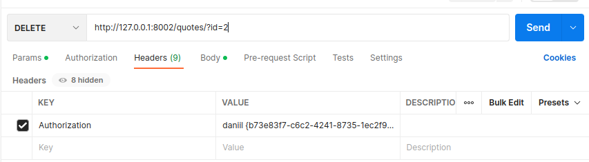
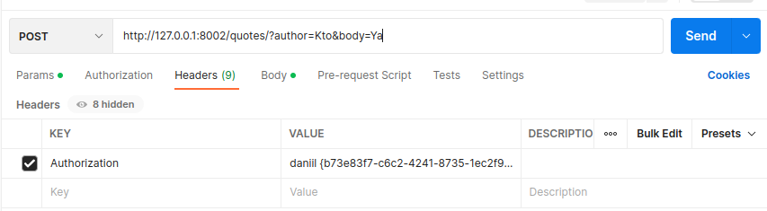

# Install

- pip install -r requirements.txt

# env

- PG_HOST: postgresql host
- PG_USER: postgresql username
- PG_PASSWORD: postgresql password
- PG_PORT: postgresql port
- PG_DBNAME: postgresql dbname

# First run 

- docker run -d --name api_project -p 5437:5432 -v $HOME/postgres/api_project:/var/lib/postgres/api_project -e POSTGRES_PASSWORD=change_me -e POSTGRES_USER=daniil -e POSTGRES_DB=api postgres
- python3.10 init.py (Please save your token and username)
- python3.10 main.py
- Go to http://127.0.0.1:8002/

# GET REQUEST EXAMPLES

# DELETE REQUEST EXAMPLE

# POST REQUEST EXAMPLE

# PUT REQUEST EXAMPLE

